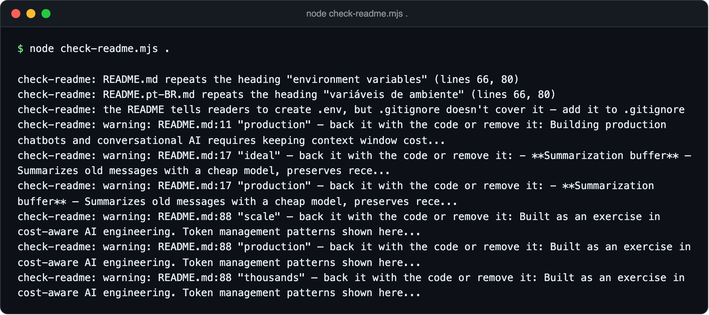
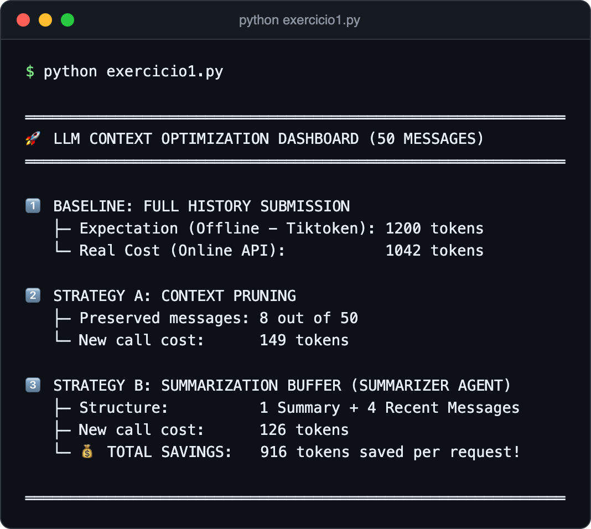
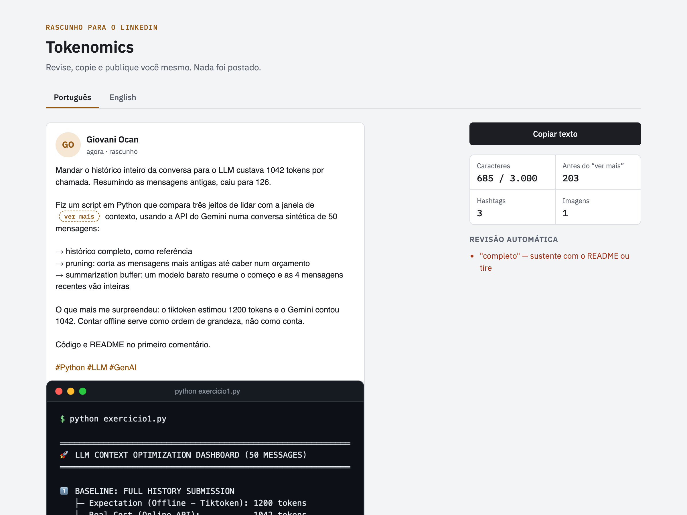

# Post Your Project

**English** · [Português](README.pt-BR.md)

> A Claude Code plugin that transforms a repository into a public-ready portfolio: a bilingual README written from the actual code, real screenshots of the running project, and a LinkedIn post draft with preview.



## About

This plugin reads your code before writing a word, runs your project to capture real screenshots, generates both READMEs in parallel, then verifies them with automated checks — because the failures that matter in a README published on GitHub are easy to miss on reread. The tool exists because features the code doesn't have and commands that don't run are the fastest ways to lose credibility.

It started as a personal tool for a Brazilian developer's portfolio projects, which is why Portuguese is a first-class language here, not an afterthought.

## Features

- **README from code, not guessing** — features, stack, and commands are traced to manifests, routes, and scripts; anything that doesn't appear in code stays out
- **Two native languages** — `README.md` in English and `README.pt-BR.md` written directly in Portuguese, each with its own voice, plus a language switcher on both
- **Real screenshots** — web apps captured in headless Chrome as they run; CLIs and scripts rendered as terminal output from actual executions; mobile apps from the simulator
- **Automated verification** — broken links and images, License sections without a LICENSE file, `.env` files the README requires that aren't in `.gitignore`, and unsupported claims flagged by line
- **Leak detection** — secrets in the text block the build; personal data and already-exposed files are reported by category, never by value
- **Pull request workflow** — README work lands on its own `readme` branch; the plugin opens the PR, prepares the post, and asks one question before proceeding
- **LinkedIn post with preview** — generates a draft in your own voice (from posts you provide), with a private preview showing the "see more" fold, character count, and a copy button ready to go

## Screenshots

| Terminal output as an image | LinkedIn post preview |
| --- | --- |
|  |  |

## Tech stack

- **Runtime:** Node.js (tested with Node 24)
- **Browser automation:** Playwright (headless Chrome)
- **Scripts:** JavaScript (`.mjs` modules)
- **CLI tools:** git, GitHub CLI (`gh`)
- **Mobile:** iOS simulator (Xcode) or Android emulator

## Getting started

### Prerequisites

- [Claude Code](https://code.claude.com)
- Node.js 20+
- Google Chrome — or `npm install -g playwright` for Chromium
- git and the GitHub CLI (`gh`)
- iOS simulator (Xcode) or Android emulator for mobile screenshots

Developed and tested on macOS.

### Installation

```
/plugin marketplace add giovaniocan/post-your-project
/plugin install post-your-project@giovaniocan
```

The plugin installs its only dependency (`playwright-core`) inside its own folder the first time you ask for screenshots.

### Usage

Open Claude Code in a project directory or anywhere with a GitHub repository link, then ask in plain language:

```
gera um README em inglês e português com prints do sistema
deixa esse repo bonito pro portfólio
escreve um post pro LinkedIn sobre esse projeto
write a README for this repo
```

For LinkedIn posts, the plugin asks for two or three of your own posts the first time and saves them to `~/.claude/post-your-project/voice.md`, outside the plugin, so your voice stays yours.

## How publishing works

After the plugin opens the pull request and prepares the post, you review and approve. Then:

1. For the README: review the PR on GitHub and merge when you're happy
2. For the LinkedIn post: the plugin opens LinkedIn in your browser with the post already in the composer (bold title, paragraphs, the `Link: …` line and tech stack) and copies the post's images, numbered, into `Downloads/linkedin-posts/<project>/`

Then you:
1. Close the link card (its X in the LinkedIn composer)
2. Click Media, navigate to the folder (or Ctrl/Cmd+V if it opens elsewhere), select all images
3. Press Publish

LinkedIn's composer only accepts images through the Media button — pasting or dragging doesn't work. The browser reopens the file window where it last used it, so reposting the same project usually skips the navigation step.

## What it won't do

- **Invent features.** When it can't run something, it says so and asks you for a screenshot instead of guessing
- **Leak secrets or personal data.** A README that reaches GitHub is public forever, and the plugin treats it that way
- **Act without permission.** It commits the README to a new branch and opens a PR, but doesn't merge or publish without your explicit approval for each step
- **Drive LinkedIn or sign in.** The plugin prepares the post in your browser and stops; you handle the final step

## Project structure

```
.claude-plugin/               Plugin and marketplace manifests
skills/post-your-project/
  SKILL.md                   The detailed instructions Claude reads and follows
  references/
    readme-template.md       Structure and sections both READMEs use
    linkedin-post.md         Writing rules for the post and examples
  scripts/
    capture.mjs              Screenshots of a running web app
    terminal.mjs             Real command output drawn as a terminal window
    check-readme.mjs         Verifies both READMEs for links, leaks, claims
    post-preview.mjs         Generates the LinkedIn preview and review notes
    linkedin-share.mjs       Opens LinkedIn with the post and images ready
    linkedin-text.mjs        Bold title and share link utilities
    leaks.mjs                Secret and personal-data detection patterns
    wording.mjs              Promise-word and stock-phrase detection
    browser.mjs              Shared headless Chrome setup
```

## License

Distributed under the MIT License. See [LICENSE](LICENSE).
