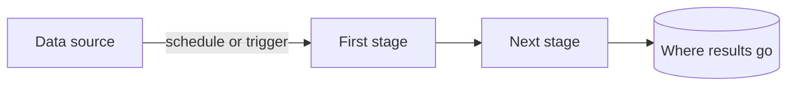

# README template

The structure both READMEs follow. Sections marked *(if …)* are left out when
the condition doesn't hold — an empty or padded section looks worse than none.
Write the English file first; the Portuguese one mirrors it section by section.

## Contents

1. Language switcher and title
2. Pitch and hero screenshot
3. About
4. Features
5. Screenshots *(if more than one image)* — or Sample output, for terminal projects
6. Architecture *(if a diagram explains more than prose)*
7. Tech stack
8. Getting started
9. Environment variables *(if `.env.example` or a config schema exists)*
10. Running tests *(if tests exist)*
11. Project structure *(if the layout isn't obvious)*
12. License *(if a `LICENSE` file exists)*

---

## 1. Language switcher and title

English file:

```markdown
# Project Name

**English** · [Português](README.pt-BR.md)
```

Portuguese file:

```markdown
# Project Name

[English](README.md) · **Português**
```

Use the project's real name (from the manifest or the existing README), not the
repo slug, unless they are the same thing. Badges go on the line under the
switcher, and only real ones: a CI badge when `.github/workflows` exists, a
license badge when `LICENSE` exists. Never a coverage or version badge that
nothing updates.

## 2. Pitch and hero screenshot

```markdown
> One sentence: what it does and for whom.


```

The alt text describes what the image shows — it is what screen readers say and
what appears when the image fails to load. For a project without a screen, the
hero is the terminal image rendered from a real run.

## 3. About

Two to four sentences: the problem, how this project approaches it, and what is
notable about the implementation (offline-first, hexagonal architecture,
real-time sync…) when the code shows it. If it was built for a course, a
hackathon or a client, say so — it frames everything else.

## 4. Features

```markdown
- **Order tracking** — follow each order from creation to delivery.
- **CSV export** — download any filtered list as a spreadsheet.
```

What the *user* can do, not what the code contains ("uses Redux" is stack, not
a feature). Only what exists in the code. Five to eight items; group them under
small subheadings if there are more.

## 5. Screenshots *(if more than one image)*

```markdown
| Orders | Order details |
| --- | --- |
|  |  |
```

Two per row at most — at three, desktop captures shrink until the text is
unreadable on GitHub. Don't repeat the hero image here. A single wide image
(full-page capture) can stand on its own row.

For a terminal project, this section is **Sample output** instead: the same run
as the hero image, as text in a code block, so readers can copy from it. Leave
it out when the hero image already shows everything and nothing in it is worth
copying.

## 6. Architecture *(if a diagram explains more than prose)*

````markdown

````

Every node and arrow is something you found in the code. Five to ten nodes;
past that, it stops explaining. Skip the section for a plain CRUD app.

## 7. Tech stack

Grouped, taken from the manifests:

```markdown
- **Frontend:** Next.js 14, React 18, Tailwind CSS
- **Backend:** NestJS, PostgreSQL, Drizzle ORM
- **Testing:** Vitest, Playwright
- **Infra:** Docker, GitHub Actions
```

Major versions only. Skip utility libraries nobody chooses a project for.

## 8. Getting started

Prerequisites, then installation, then how to open it:

```markdown
### Prerequisites

- Node.js 20+
- Docker (for the database)

### Installation
```

followed by a `bash` block such as:

```bash
git clone https://github.com/<owner>/<repo>.git
cd <repo>
npm install
cp .env.example .env
npm run dev
```

and a closing line like "Open http://localhost:3000."

Every command comes from a real script, and every file a command touches
(`.env.example`, `requirements.txt`, the entry script) exists in the repo — the
check script flags the ones that don't. Prerequisites match what the project
actually needs (an `engines` field, `.nvmrc`, `.python-version`,
`requires-python`, compose services). When nothing pins a version, name the one
you ran it with ("tested with Python 3.11") instead of guessing a minimum. If
there is no `.env.example`, show how to create the file
(`echo "<VARIABLE>=..." > .env`) rather than copying one that doesn't
exist. If a mock API or database has to be running, say how to start it.

## 9. Environment variables *(if `.env.example` or a config schema exists)*

```markdown
| Variable | What it's for |
| --- | --- |
| `DATABASE_URL` | PostgreSQL connection string |
| `NEXT_PUBLIC_API_URL` | Base URL of the API |
```

Names and purpose only — never values, not even example ones that look real.

## 10. Running tests *(if tests exist)*

The real command (`npm test`, `pytest`) and, in one line, what kind of tests
they are.

## 11. Project structure *(if the layout isn't obvious)*

A short tree of the top one or two levels with a comment on each important
folder. Skip it for a standard single-framework layout that any developer
already knows.

## 12. License *(if a `LICENSE` file exists)*

```markdown
Distributed under the MIT License. See [LICENSE](LICENSE).
```

If there is no `LICENSE`, leave the section out and mention it to the user in
the hand-back instead.

---

## Portuguese section names

| English | Português |
| --- | --- |
| About | Sobre |
| Features | Funcionalidades |
| Screenshots | Telas |
| Sample output | Exemplo de saída |
| Architecture | Arquitetura |
| Tech stack | Tecnologias |
| Getting started | Como rodar |
| Prerequisites | Pré-requisitos |
| Installation | Instalação |
| Environment variables | Variáveis de ambiente |
| Running tests | Testes |
| Project structure | Estrutura do projeto |
| License | Licença |

Alt texts and table headers get translated too; image paths, commands, code and
variable names don't.
